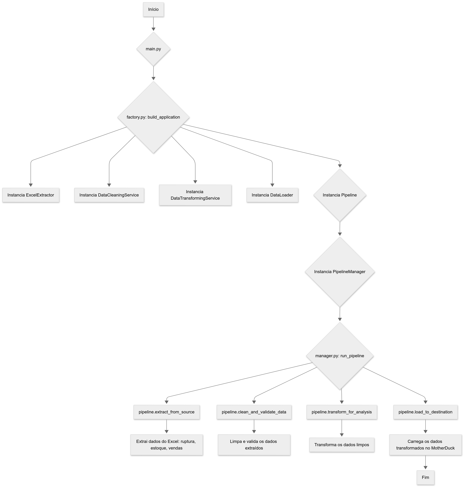

# Projeto "Ruptura Zero": Análise de Vendas e Estoque

> _Um pipeline de ETL robusto para transformar dados de vendas em insights acionáveis, diagnosticando rupturas de estoque e otimizando o inventário._

[](https://www.linkedin.com/in/alexcamargos)

[](LICENSE)
[](https://www.python.org/downloads/)


## 💡 Sobre o Projeto
O "Ruptura Zero" é um pipeline de ETL desenvolvido em Python para diagnosticar a causa raiz da queda de vendas em uma empresa. O projeto nasceu da hipótese de que a má gestão de inventário estava gerando ruptura de estoque (falta de produtos), impactando diretamente a receita.

Este pipeline automatiza a extração de dados brutos de vendas e estoque de arquivos Excel, aplica um rigoroso processo de limpeza e transformação, e utiliza `Pandera` para garantir a integridade dos dados. O resultado final é um dataset consolidado e confiável, pronto para análise, permitindo que a área de negócio identifique exatamente quais produtos estão em falta e onde, transformando dados em um plano de ação para otimização de inventário e recuperação do crescimento.


- [Projeto "Ruptura Zero": Análise de Vendas e Estoque](#projeto-ruptura-zero-análise-de-vendas-e-estoque)
  - [💡 Sobre o Projeto](#-sobre-o-projeto)
  - [🛠️ Stack de Tecnologias](#️-stack-de-tecnologias)
  - [✨ Funcionalidades Principais](#-funcionalidades-principais)
  - [🏛️ Arquitetura e Padrões](#️-arquitetura-e-padrões)
  - [🚀 Como Instalar e Executar](#-como-instalar-e-executar)
  - [📊 Resultados e Entregáveis](#-resultados-e-entregáveis)
  - [🧠 Desafios Técnicos e Aprendizados](#-desafios-técnicos-e-aprendizados)
    - [1. Garantia da Qualidade dos Dados para Confiança no Resultado](#1-garantia-da-qualidade-dos-dados-para-confiança-no-resultado)
    - [2. Controle e Manutenibilidade do Fluxo de ETL](#2-controle-e-manutenibilidade-do-fluxo-de-etl)
    - [3. Habilitação de Análises Complexas e Acesso aos Dados](#3-habilitação-de-análises-complexas-e-acesso-aos-dados)
    - [4. Transformando um Script de Dados em um Produto de Software](#4-transformando-um-script-de-dados-em-um-produto-de-software)
  - [🚀 Próximos Passos](#-próximos-passos)
  - [✍️ Autor](#️-autor)
  - [📜 Licença](#-licença)


## 🛠️ Stack de Tecnologias
| Categoria | Ferramenta |
| :--- | :--- |
| **Gerenciador de Dependências** |  |
| **Linguagem Principal** |  |
| **Análise de Dados** |   |
| **Validação de Dados** |  |
| **Data Warehouse** |   |


## ✨ Funcionalidades Principais
- **🔌 Extração de Dados**: Leitura e parsing de múltiplas fontes de dados em formato `.xlsx`.
- **🧹 Limpeza e Transformação**: Normalização de formatos, tratamento de valores nulos e enriquecimento de dados.
- **🛡️ Validação Robusta**: Implementação de esquemas `Pandera` para garantir a qualidade e a consistência dos dados em cada etapa.
- **📊 Análise e Agregação**: Cruzamento de tabelas de vendas e estoque para o cálculo preciso de métricas de ruptura.
- **📤 Carga de Dados**: Exportação dos dados processados para arquivos `.csv` e carga em um data warehouse serverless **MotherDuck** para análise SQL imediata.


## 🏛️ Arquitetura e Padrões
O projeto segue um fluxo de dados desacoplado, utilizando o padrão Factory para orquestrar as etapas de Extração, Transformação e Carga, garantindo manutenibilidade e escalabilidade.



- **/ruptura_zero/extractor**: Módulos responsáveis pela extração de dados de fontes externas (ex: planilhas Excel).
- **/ruptura_zero/transformer**: Contém a lógica de negócio para limpeza, transformação e validação dos dados. Utiliza **Pandera** para definir e aplicar esquemas de validação, garantindo a robustez do pipeline.
- **/ruptura_zero/services**: Orquestra as etapas limpesa e transformação do pipeline, desacoplando do pipeline principal o status de cada etapa.
- **/ruptura_zero/loader**: Responsável por carregar os dados transformados em um destino final, arquivos CSV consolidados e data warehouse na nuvem (MotherDuck).
- **/ruptura_zero/factory.py**: Aplica o padrão de projeto **Factory** para criar instâncias de componentes do pipeline de forma desacoplada.

Essa arquitetura modular e o uso de validação de dados demonstram um foco em criar um sistema de dados confiável e escalável.


## 🚀 Como Instalar e Executar

**Pré-requisitos:**
- Python 3.11 ou superior
- `uv` instalado (`pip install uv`)

**Passos:**

1.  Clone o repositório:
    ```bash
    git clone https://github.com/alexcamargos/etl_ruptura_zero.git
    cd etl_ruptura_zero
    ```

2.  Crie e ative um ambiente virtual:
    ```bash
    uv venv
    source .venv/bin/activate  # No Windows: .venv\Scripts\activate
    ```

3.  Instale as dependências do projeto:
    ```bash
    uv pip sync pyproject.toml
    ```

4.  Execute o pipeline de ETL:
    ```bash
    python main.py
    # Ao final da execução, verifique a pasta `data/processed/` pelos arquivos gerados.
    ```

## 📊 Resultados e Entregáveis
Ao final da execução, o pipeline produz dois tipos de entregáveis, prontos para diferentes casos de uso:

**1. Arquivos CSV Consolidados**
Para análise local, portabilidade ou importação rápida em outras ferramentas, os seguintes arquivos são gerados na pasta `data/processed/`:
- `ruptura_estoque_vendas.csv`: O dataset final consolidado, contendo a união dos dados de vendas e estoque.

**2. Data Warehouse na Nuvem (MotherDuck)**
Para análise interativa e escalável, o dataset consolidado é carregado em uma tabela no MotherDuck. Isso o torna imediatamente acessível para:
- Consultas complexas usando SQL.
- Conexão direta com ferramentas de Business Intelligence (BI) como Tableau ou Power BI.


## 🧠 Desafios Técnicos e Aprendizados

A construção deste pipeline foi uma jornada de aprendizado em engenharia de dados, focada em robustez, manutenibilidade e valor de negócio.

### 1. Garantia da Qualidade dos Dados para Confiança no Resultado
- **O Problema:** A fonte de dados (planilhas Excel) era um ambiente dinâmico e pouco confiável. Inconsistências como tipos de dados errados, nomes de colunas alterados ou valores nulos inesperados poderiam corromper silenciosamente o resultado final, gerando análises incorretas e quebrando a confiança dos stakeholders.
- **A Solução:** Em vez de criar validações manuais reativas, implementei uma estratégia proativa usando **Pandera** para definir "contratos de dados" (Data Contracts). Cada DataFrame, ao entrar e sair de uma etapa de transformação, é validado contra um esquema rigoroso. Se o contrato for violado, o pipeline falha de forma explícita e imediata, impedindo a propagação de dados de baixa qualidade.
- **O Aprendizado:** Compreendi que a qualidade dos dados não é uma etapa, mas uma garantia contínua. Adotar uma abordagem de "Data Quality as Code" com Pandera tornou o pipeline não apenas mais robusto, mas também autodocumentado, onde os esquemas servem como uma fonte única de verdade sobre a estrutura dos dados.

### 2. Controle e Manutenibilidade do Fluxo de ETL
- **O Problema:** Um script monolítico que executa extração, transformação e carga em sequência é frágil e difícil de manter. Alterar a fonte de dados ou adicionar uma nova regra de negócio exigiria uma refatoração arriscada e complexa.
- **A Solução:** Estruturei o código aplicando princípios SOLID e o padrão de projeto **Factory**. Cada etapa do ETL (Extract, Transform, Load) foi isolada em seu próprio módulo com responsabilidades claras. A factory `build_application` orquestra a execução, injetando as dependências corretas sem que o orquestrador conheça os detalhes de implementação de cada componente.
- **O Aprendizado:** Esta arquitetura me ensinou na prática o valor do baixo acoplamento e da alta coesão. O sistema tornou-se modular, testável e extensível. Agora, para suportar uma nova fonte de dados (ex: um banco de dados), basta criar uma nova classe `Extractor` sem impactar o resto da aplicação, demonstrando a importância de design patterns para a escalabilidade de projetos de dados.

### 3. Habilitação de Análises Complexas e Acesso aos Dados
- **O Problema:** Gerar um arquivo CSV como resultado final resolve a consolidação, mas cria um novo problema: os dados ficam "presos" em um arquivo estático. Para qualquer análise mais profunda, um usuário precisaria realizar um processo manual de download e importação em outra ferramenta, atrasando a geração de insights.
- **A Solução:** Integrei uma etapa de carga final para um data warehouse em nuvem, o **MotherDuck**. Após o processamento, o dataset limpo e consolidado é carregado diretamente em uma tabela otimizada para análises.
- **O Aprendizado:** Entendi que o objetivo de um pipeline de ETL não é apenas "mover e limpar dados", mas sim reduzir o "tempo-para-insight" (time-to-insight). Ao disponibilizar os dados em uma plataforma analítica como o MotherDuck, o resultado do pipeline se torna um ativo de dados vivo e imediatamente acionável por analistas e ferramentas de BI via SQL, agregando muito mais valor ao negócio do que um simples arquivo CSV.

### 4. Transformando um Script de Dados em um Produto de Software
- **O Problema:** Um pipeline de dados pode facilmente se tornar um "script" longo e de difícil manutenção. Sem uma estrutura definida, gerenciamento de dependências e padrões de qualidade, o projeto se torna frágil, difícil de testar e quase impossível de ser mantido ou expandido por outra pessoa.
- **A Solução:** Abordei a construção do pipeline aplicando um conjunto rigoroso de práticas de engenharia de software desde o início:
    - **Estrutura de Projeto Modular:** O código foi organizado em módulos com responsabilidades únicas (`extractor`, `transformer`, `loader`), facilitando a navegação e a manutenção.
    - **Gerenciamento de Dependências Moderno:** Utilizei `pyproject.toml` e `uv` para garantir um ambiente de desenvolvimento 100% reprodutível e isolado, eliminando o problema de "funciona na minha máquina".
    - **Qualidade e Estilo de Código:** Adotei ferramentas de linting e formatação (como `Ruff` e `Black`) para manter um padrão de código consistente e legível em todo o projeto.
    - **Separação de Configuração e Lógica:** Parâmetros como caminhos de arquivos e configurações foram externalizados, permitindo que o pipeline seja executado em diferentes ambientes sem alterar o código-fonte.
- **O Aprendizado:** O aprendizado fundamental foi **tratar o pipeline de dados como um produto de software, não como um script descartável**. Aplicar essas práticas aumenta a confiança no sistema, acelera o desenvolvimento de novas funcionalidades e garante que o projeto seja robusto e escalável o suficiente para ser colocado em produção.


## 🚀 Próximos Passos
Este projeto é uma base sólida, e os próximos passos planejados para evoluí-lo incluem:
- [ ] **Dashboard Interativo com Streamlit**: Desenvolver um painel visual para apresentar os resultados da análise de ruptura, permitindo que usuários de negócio explorem os dados e respondam à pergunta central do projeto de forma interativa.
- [ ] **Testes Automatizados**: Implementar testes unitários com `pytest` para as regras de negócio e de transformação.
- [ ] **Containerização com Docker**: Empacotar a aplicação para garantir a reprodutibilidade do ambiente e facilitar o deploy.
- [ ] **Orquestração de Workflow**: Migrar a execução para uma ferramenta como Mage ou Airflow para agendamento, monitoramento e retentativas.


## ✍️ Autor

Feito com ❤️ por [Alexsander Lopes Camargos](https://github.com/alexcamargos) 👋 Entre em contato!

[](https://github.com/alexcamargos)
[](https://twitter.com/alcamargos)
[](https://www.linkedin.com/in/alexcamargos/)
[](mailto:alcamargos@vivaldi.net)


## 📜 Licença
Este projeto está sob a licença MIT. Veja o arquivo [LICENSE](LICENSE) para mais detalhes.
